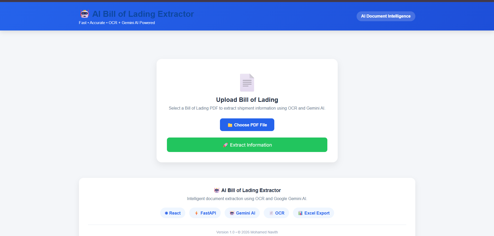
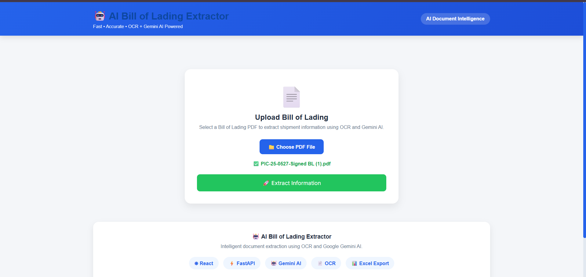
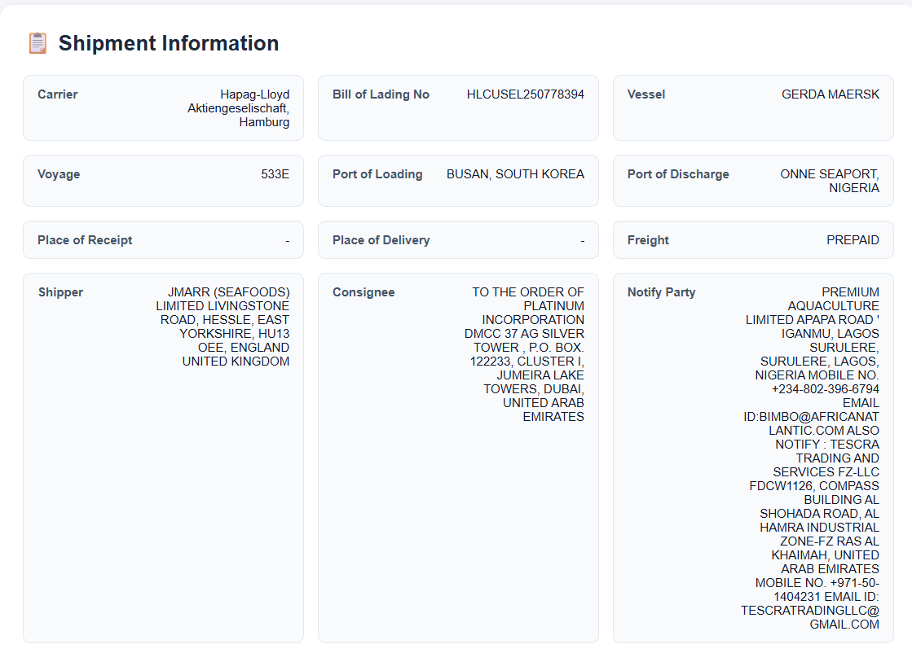
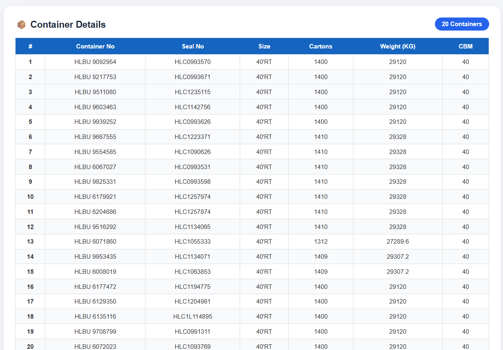
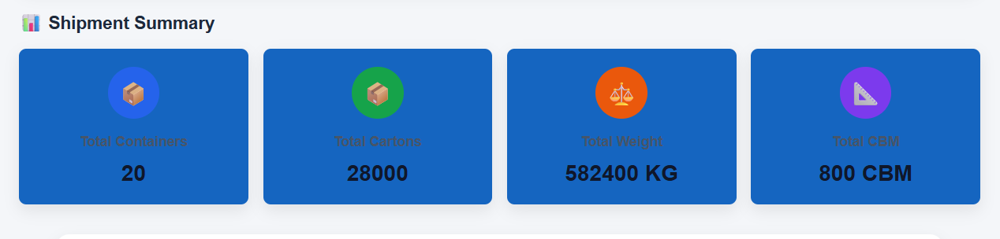
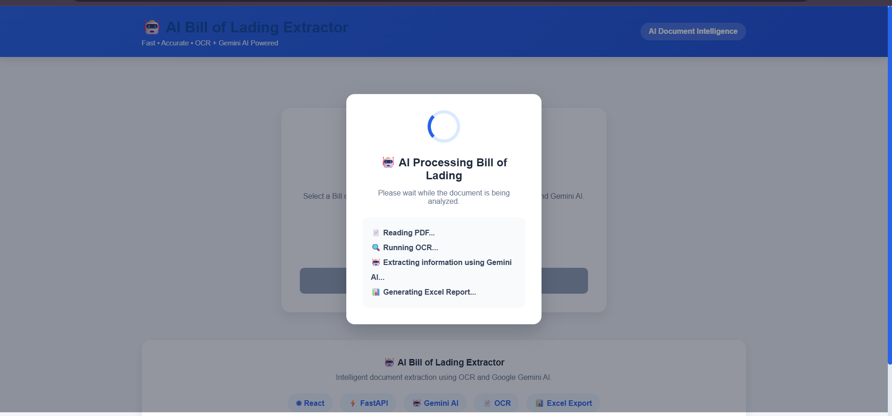

# 🤖 AI Bill of Lading Extractor using OCR & Google Gemini AI

An AI-powered web application that automatically extracts structured information from **Bill of Lading (B/L)** PDF documents using **Google Gemini AI**, **Tesseract OCR**, **PyMuPDF**, **FastAPI**, and **React**. The extracted shipment information is displayed through an interactive dashboard and can be exported as **Excel** or **JSON**.

---

# 📌 Project Overview

The **AI Bill of Lading Extractor** is designed to automate the extraction of shipment information from Bill of Lading documents used in the logistics and shipping industry.

Traditional document processing requires manual reading and data entry, which is time-consuming and prone to errors. This project uses Artificial Intelligence and OCR to automatically extract structured information from both **digital** and **scanned** Bill of Lading PDFs.

If the uploaded PDF contains embedded text, the application extracts it using **PyMuPDF**. If the PDF is scanned, it automatically switches to **Tesseract OCR**. The extracted text is then analyzed by **Google Gemini AI**, which converts the unstructured text into structured shipment information.

The extracted information is displayed in a responsive React dashboard and can be downloaded as **Excel** or **JSON**.

---

# ✨ Features

- 📄 Upload Bill of Lading PDF
- 🤖 AI-powered data extraction using Google Gemini AI
- 🔍 Automatic OCR for scanned PDFs
- 📑 Multi-page PDF support
- 🚢 Shipment Header extraction
- 📦 Container Details extraction
- 📊 Shipment Summary generation
- 📥 Export extracted data to Excel
- 📄 Export extracted data to JSON
- ⚡ FastAPI backend
- ⚛ React frontend
- 📱 Responsive user interface

---

# ⭐ Key Highlights

- Supports both digital and scanned Bill of Lading PDFs.
- Automatically detects when OCR is required.
- Uses Google Gemini AI for intelligent document understanding.
- Extracts structured shipment information with high accuracy.
- Generates Excel and JSON reports.
- Clean and responsive React dashboard.
- REST API developed using FastAPI.
- Modular and scalable project architecture.

---

# 🛠 Technology Stack

## Frontend

- React (Vite)
- JavaScript (ES6)
- CSS3
- Axios

## Backend

- Python
- FastAPI
- Uvicorn

## AI & OCR

- Google Gemini AI
- Tesseract OCR
- PyMuPDF (fitz)

## Data Processing

- Pandas
- OpenPyXL

---

# 📂 Project Structure

```text
AI-BL-Extractor/
│
├── backend/
│   ├── app/
│   │   ├── routes/
│   │   ├── services/
│   │   ├── models/
│   │   ├── utils/
│   │   └── main.py
│   │
│   ├── uploads/
│   ├── output/
│   ├── requirements.txt
│   └── .env
│
├── frontend/
│   ├── src/
│   │   ├── api/
│   │   ├── components/
│   │   ├── pages/
│   │   ├── styles/
│   │   ├── App.jsx
│   │   └── main.jsx
│   │
│   ├── package.json
│   └── vite.config.js
│
├── screenshots/
│
├── README.md
├── API_DOCUMENTATION.md
└── LICENSE
```

---

# 🚀 Installation

## Clone Repository

```bash
git clone https://github.com/MdNvD/AI-BL-Extractor.git
```

---

## Backend Setup

```bash
cd backend

python -m venv venv

venv\Scripts\activate

pip install -r requirements.txt
```

Create a **.env** file:

```env
GEMINI_API_KEY=YOUR_GEMINI_API_KEY
```

Run the backend:

```bash
uvicorn app.main:app --reload
```

Backend URL

```
http://127.0.0.1:8000
```

---

## Frontend Setup

```bash
cd frontend

npm install

npm run dev
```

Frontend URL

```
http://localhost:5173
```

---

# 🔄 Application Workflow

```
Upload Bill of Lading PDF
            │
            ▼
Detect PDF Type
            │
      ┌──────────────┐
      │              │
      ▼              ▼
Digital PDF     Scanned PDF
      │              │
      ▼              ▼
 PyMuPDF      Tesseract OCR
      │              │
      └──────┬───────┘
             ▼
      Extracted Text
             ▼
     Google Gemini AI
             ▼
 Structured Shipment Data
             ▼
 Display in React Dashboard
             ▼
 Excel / JSON Export
```

---

# 📋 Extracted Information

## Shipment Header

- Carrier
- Bill of Lading Number
- Vessel
- Voyage
- Port of Loading
- Port of Discharge
- Place of Receipt
- Place of Delivery
- Freight
- Shipper
- Consignee
- Notify Party

---

## Container Details

- Container Number
- Seal Number
- Container Size
- Cartons
- Weight
- CBM

---

## Shipment Summary

- Total Containers
- Total Cartons
- Total Weight
- Total CBM

---

# 🎯 Demo Output

The application successfully extracts:

- ✅ Shipment Header
- ✅ Carrier Details
- ✅ Bill of Lading Number
- ✅ Vessel & Voyage
- ✅ Shipper Information
- ✅ Consignee Information
- ✅ Notify Party
- ✅ Container Details
- ✅ Shipment Summary
- ✅ Excel Report
- ✅ JSON Report

---

# 📸 Screenshots

## 🏠 Home Page



---

## 📤 Upload PDF



---

## 🤖 AI Extraction Result



---

## 📋 Shipment Information


---

## 📦 Container Details



---

## 📊 Shipment Summary



---

## 📄 Container Details (Excel)


---

## 📈 Shipment Summary (Excel)


---

## 📥 Export Results


---

## ⏳ Processing Screen



---

# 🌐 API Endpoints

| Method | Endpoint | Description |
|---------|----------|-------------|
| POST | `/api/upload` | Upload Bill of Lading PDF |
| GET | `/api/bl-extract/{filename}` | Extract shipment information |
| GET | `/api/download/excel/{filename}` | Download Excel report |
| GET | `/api/download/json/{filename}` | Download JSON report |

For detailed API documentation, see **API_DOCUMENTATION.md**.

---

# 🎯 Future Enhancements

- User Authentication
- Batch PDF Processing
- Cloud Deployment
- Database Integration
- AI Confidence Score
- Dashboard Analytics
- Search & Filter
- Support for Invoice, Packing List and Commercial Invoice
- Docker Deployment

---

# 👨‍💻 Author

**Mohamed Navith**

B.Tech – Computer Science and Engineering

Passionate about Full Stack Development, Artificial Intelligence, and Cloud Technologies.

---

# 📜 License

This project is licensed under the MIT License.

---

## ⭐ Support

If you found this project helpful, consider giving it a ⭐ on GitHub.